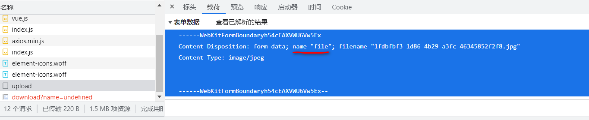

# 功能记录

## 1.Bean到controller

```java
@Data
public class Employee implements Serializable {...}
```

```java
@Mapper
public interface EmployeeMapper extends BaseMapper<Employee> {
}
```

```
public interface EmployeeService extends IService<Employee> {
}
```

```java
@Service
public class EmployeeServiceImpl extends ServiceImpl<EmployeeMapper, Employee> implements EmployeeService {
} 
```

```java
@Slf4j
@RestController
@RequestMapping("/employee")
public class EmployeeController {

    @Autowired
    private EmployeeService employeeService;
}
```


> 注意:在backend,request.js中更改前端接收响应的时间,方便debug

```
    // 超时,运行为10000,debug时为1000000
    timeout: 1000000
```


## 2.拦截未登录的请求

防止用户在未登录的情况下访问到其他界面

(1)框架

```java
//设置过滤器名字和拦截pattern,在main类中设置@ServletComponentScan进行组件扫描
@WebFilter(filterName = "LoginFilter",urlPatterns = "/*")
@Slf4j
public class LoginFilter implements Filter {

    @Override
    public void doFilter(ServletRequest servletRequest, ServletResponse servletResponse, FilterChain filterChain) throws IOException, ServletException {
        HttpServletRequest request = (HttpServletRequest) servletRequest;
        log.info("拦截到请求{}",request.getRequestURL());
        filterChain.doFilter(request,servletResponse);
    }
}
```

(2)逻辑

```java
//路径匹配器,支持通配符
    public static final AntPathMatcher PATH_MATCHER = new AntPathMatcher();

    @Override
    public void doFilter(ServletRequest servletRequest, ServletResponse servletResponse, FilterChain filterChain) throws IOException, ServletException {
        HttpServletRequest request = (HttpServletRequest) servletRequest;
        HttpServletResponse response = (HttpServletResponse)servletResponse;
//        log.info("拦截到请求{}",request.getRequestURL());
        //1.获取本次请求的URI,这里URI(/employee/login)和URL(http://localhost:8080/backend/page/login/login.html)完全不同
        String requestURI = request.getRequestURI();
//        log.info("Url:{}",request.getRequestURL());
        log.info("URI{}",requestURI);
        //定义不需要处理的请求路径,登录登出不需要,静态页面也不需要(数据都是动态ajax向服务端的数据库请求的)
        String[] urls = new String[]{
            "/employee/login",
            "/employee/logout",
            "/backend/**",
            "/front/**"
        };
        //2.判断是否需要登录验证,不需要登录则返回
        boolean check = checkURLs(urls, requestURI);
        if(check){
            filterChain.doFilter(request, response);
            log.info("无需登录");
            return;//注意不要忘记返回
        }
        //3.若需要登录,就判断登录状态,如果登录了就放行
        if(request.getSession().getAttribute("employee") != null){
            log.info("已经登录");
            filterChain.doFilter(request, response);
            return;//注意不要忘记返回
        }
        //4.未登录,则根据前端的要求(request.js),设置响应
        //以输出流响应前端
        log.info("未登录");
        response.getWriter().write(JSON.toJSONString(R.error("NOTLOGIN")));
        return;
    }

    /**
     * 判断requestURL是否是不需要验证登录的url
     * @param urls
     * @param requestURI
     * @return
     */
    private boolean checkURLs(String[] urls,String requestURI){
        for (String url : urls) {
            boolean match = PATH_MATCHER.match(url ,requestURI);
            if(match)
                return true;
        }
        return false;
    }
```


> 关于doFilter后要返回的问题:
>
>
> 调用doFilter后,Filter链的下一个filter执行,如此知道全部filter执行完成,按照逆序(这一点跟springboot中的拦截器一样)返回到每个filter,执行他们后面的代码,所以是需要return的


> 区分URI和URL:
>
> URL:http://localhost:8080/backend/page/login/login.html (是浏览器上url栏的内容)
>
> URI:/employee/login 向服务器发送的请求


## 3.增加用户

```java
/**
 * 根据提交的表单,生成数据库记录,并初始化
 * @param request
 * @param employee
 * @return
 */
@PostMapping
public R<String> addEmployee(HttpServletRequest request,@RequestBody Employee employee){
    log.info(employee.toString());
    //设置初始密码123456,使用md5加密
    employee.setPassword(DigestUtils.md5DigestAsHex("123456".getBytes()));
    //设置创建时间和修改时间
    employee.setCreateTime(LocalDateTime.now());
    employee.setUpdateTime(LocalDateTime.now());
    //获得当前登录用户的id以设置创建人
    long creatorId = (long) request.getSession().getAttribute("employee");
    employee.setCreateUser(creatorId);
    employee.setUpdateUser(creatorId);
    employeeService.save(employee);
    return R.success("新员工添加成功");
}
```

> 注意:这里在类上有注解@PostMapping("/employee"),不要在方法上重复这个路径

如果插入重复的username,则会从mysql抛出一个异常,我们用全局异常类来处理


## 4.全局异常类捕获增加用户的异常

```java
/**
 * 全局异常处理类,方法返回响应体
 */
@ControllerAdvice(annotations = {RestController.class, Controller.class})
@Slf4j
@ResponseBody
public class GlobalExceptionHandler {

    @ExceptionHandler(SQLIntegrityConstraintViolationException.class)
    public R<String> exceptionHandler(SQLIntegrityConstraintViolationException ex){
//      error message:Duplicate entry '123456' for key 'idx_username'
        String message = ex.getMessage();
        if (message.contains("Duplicate entry")){
            //按照" "将字符创分为小串
            String[] split = message.split(" ");
            String msg = "用户名" + split[2] + "已存在";
            return R.error(msg);
        }
        return R.error("未知错误");
    }
}
```


> tips,使用ctrl+F5,清除缓存刷新


## 5.分页功能

首先配置mybatis-plus的分页插件,为此需要一个mybatis-plus的配置类

```java
/**
 * 配置mybatisPlus中的分页插件
 */
@Configuration
public class MybatisPlusConfig {
    @Bean
    public MybatisPlusInterceptor mybatisPlusInterceptor(){
        MybatisPlusInterceptor mybatisPlusInterceptor = new MybatisPlusInterceptor();
        mybatisPlusInterceptor.addInnerInterceptor(new PaginationInnerInterceptor());
        return mybatisPlusInterceptor;
    }
}

```

 在EmployeeController类中,捕获分页的请求

```java
/**
     * 处理请求http://localhost:8080/employee/page?page=1&pageSize=10
     * @return
     */
    @GetMapping("/page")
    public R<Page> page(int page,int pageSize,String name){
//        log.info("page:{},pageSize:{}",page,pageSize);
        //1.构造分页对象
        Page<Employee> employeePage = new Page<>(page,pageSize);
        //2.构造查询条件
        LambdaQueryWrapper<Employee> queryWrapper = new LambdaQueryWrapper<>();
        //3.增加可能的过滤条件
        //如果有指定name的查询,加上过滤条件
        //参数0表示在name不为空时才进行该查询
        queryWrapper.like(StringUtils.isNotEmpty(name),Employee::getName,name);
        //4.查询结果排序
        queryWrapper.orderByDesc(Employee::getUpdateTime);
        //5.执行查询,employeeService会将数据放入我们传入的employeePage中
        employeeService.page(employeePage,queryWrapper);
        return R.success(employeePage);
    }
```

## 6.员工管理中对员工执行update操作

```java
/**
 * 对employee的修改请求(put,http://localhost:8080/employee)
 * @param request
 * @param employee 获取前端已经修改好的employee对象
 * @return
 */
@PutMapping()
public R<String> update(HttpServletRequest request,@RequestBody Employee employee){
    long empId  = (long) request.getSession().getAttribute("employee");
    employee.setUpdateTime(LocalDateTime.now());
    employee.setUpdateUser(empId);//设置是编号为empId的用户修改了本用户
    employeeService.updateById(employee);
    return R.success("修改成功");
}
```

> 这里会出现一个问题,我们在数据库中并没有找到要更新的记录,这是因为id过长,而在前端js对其进行了舍入,在Long长度大于17位时会出现精度丢失的问题.解决方法是从后端传入string给前端而不是long,为此需要消息转换器


## 7.使用消息转换器

如下消息转换器将转化java对象为json,这里将long转换为json

```java
/**
 * 对象映射器:基于jackson将Java对象转为json，或者将json转为Java对象
 * 将JSON解析为Java对象的过程称为 [从JSON反序列化Java对象]
 * 从Java对象生成JSON的过程称为 [序列化Java对象到JSON]
 */
public class JacksonObjectMapper extends ObjectMapper {

    public static final String DEFAULT_DATE_FORMAT = "yyyy-MM-dd";
    public static final String DEFAULT_DATE_TIME_FORMAT = "yyyy-MM-dd HH:mm:ss";
    public static final String DEFAULT_TIME_FORMAT = "HH:mm:ss";

    public JacksonObjectMapper() {
        super();
        //收到未知属性时不报异常
        this.configure(FAIL_ON_UNKNOWN_PROPERTIES, false);

        //反序列化时，属性不存在的兼容处理
        this.getDeserializationConfig().withoutFeatures(DeserializationFeature.FAIL_ON_UNKNOWN_PROPERTIES);


        SimpleModule simpleModule = new SimpleModule()
                .addDeserializer(LocalDateTime.class, new LocalDateTimeDeserializer(DateTimeFormatter.ofPattern(DEFAULT_DATE_TIME_FORMAT)))
                .addDeserializer(LocalDate.class, new LocalDateDeserializer(DateTimeFormatter.ofPattern(DEFAULT_DATE_FORMAT)))
                .addDeserializer(LocalTime.class, new LocalTimeDeserializer(DateTimeFormatter.ofPattern(DEFAULT_TIME_FORMAT)))

                .addSerializer(BigInteger.class, ToStringSerializer.instance)
                .addSerializer(Long.class, ToStringSerializer.instance)
                .addSerializer(LocalDateTime.class, new LocalDateTimeSerializer(DateTimeFormatter.ofPattern(DEFAULT_DATE_TIME_FORMAT)))
                .addSerializer(LocalDate.class, new LocalDateSerializer(DateTimeFormatter.ofPattern(DEFAULT_DATE_FORMAT)))
                .addSerializer(LocalTime.class, new LocalTimeSerializer(DateTimeFormatter.ofPattern(DEFAULT_TIME_FORMAT)));

        //注册功能模块 例如，可以添加自定义序列化器和反序列化器
        this.registerModule(simpleModule);
    }
}
```

在mvc配置类的消息转换器扩展方法中,加入这个消息转换器

```java
/**
     * 扩展mvc中的消息转换器
     * @param converters
     */
@Override
protected void extendMessageConverters(List<HttpMessageConverter<?>> converters) {
    log.info("扩展消息转换器");
    //消息转换器会将我们return给前端的R对象转换为对应的json
    //创建消息转换器对象
    MappingJackson2HttpMessageConverter messageConverter =
        new MappingJackson2HttpMessageConverter();
    //设置对象转换器,使用我们自己定义的消息转换器对象
    messageConverter.setObjectMapper(new JacksonObjectMapper());
    //将我们设置的消息转换器放入mvc框架的转化器集合中(放在首位才会优先使用)
    converters.add(0,messageConverter);
}
```

## 8. 处理路径参数为员工id的查询请求

```java
    /**
     * 处理按照id查询员工信息的请求(url为 /employee/id的值)
     * @param id
     * @return
     */
    @GetMapping("/{id}")
    public R<Employee> getById(@PathVariable long id){
//        log.info("id:{}",id);
        Employee employee = employeeService.getById(id);
        return R.success(employee);
    }
```


## 9.统一处理不同表的相同字段

问题:比如更新时间,创建时间等等字段,在employee表中有,在别的表也有,这会导致很多重复代码

mybatis-plus框架提供了解决方法,统一对他们进行处理:

1.在要处理的Bean类中加入注解

```java
	@TableField(fill = FieldFill.INSERT)//插入(即创建)时填充字段
    private LocalDateTime createTime;

    @TableField(fill = FieldFill.INSERT_UPDATE)//插入,更新都填充字段
    private LocalDateTime updateTime;

    @TableField(fill = FieldFill.INSERT)
    private Long createUser;

    @TableField(fill = FieldFill.INSERT_UPDATE)
    private Long updateUser;
```

2.创建一个组件实现MetaObjectHandler接口

```java
@Component
@Slf4j
public class MyMetaObjectHandler implements MetaObjectHandler {

    @Override
    public void insertFill(MetaObject metaObject) {
        log.info("insert时,进行公共字段填充");
    }

    @Override
    public void updateFill(MetaObject metaObject) {
        log.info("update时,进行公共字段填充");

    }
}
```

重写方法

```java
@Override
public void insertFill(MetaObject metaObject) {
    log.info("insert时,进行公共字段填充");
    metaObject.setValue("createTime", LocalDateTime.now());
    metaObject.setValue("updateTime", LocalDateTime.now());
    //这里暂时写死
    metaObject.setValue("updateUser", new Long(1));
    metaObject.setValue("createUser", new Long(1));
}

@Override
public void updateFill(MetaObject metaObject) {
    log.info("update时,进行公共字段填充");

    metaObject.setValue("updateTime", LocalDateTime.now());
    //这里暂时写死
    metaObject.setValue("updateUser", new Long(1));
}
```

 引入新问题,如何获得当前登录的empId?

##  10.将登录id放入线程作用域

1.创建使用线程域变量的工具类

```java
/**
 * 基于ThreadLocal封装工具类,用户保存和获取当前登录用户的id
 * 作用域在一个线程内
 */
public class BaseContext {
    private static ThreadLocal<Long> threadLocal = new ThreadLocal<>();

    public static void setCurrentId(Long id){
        threadLocal.set(id);
    }

    public static Long getCurrentId(){
        return threadLocal.get();
    }
}
```

2.过滤器中,登录成功情况下获取empId

```java
//在线程作用域中存入登录用户id
long empId = (long) request.getSession().getAttribute("employee");
BaseContext.setCurrentId(empId);
```

3.在统一处理界面将empId获取

```java
@Component
@Slf4j
public class MyMetaObjectHandler implements MetaObjectHandler {

    @Override
    public void insertFill(MetaObject metaObject) {
//        log.info("insert时,进行公共字段填充");
        metaObject.setValue("createTime", LocalDateTime.now());
        metaObject.setValue("updateTime", LocalDateTime.now());
        //通过线程域获取数据
        Long currentId = BaseContext.getCurrentId();
        metaObject.setValue("updateUser", currentId);
        metaObject.setValue("createUser", currentId);

    }

    @Override
    public void updateFill(MetaObject metaObject) {
//        log.info("update时,进行公共字段填充");
        metaObject.setValue("updateTime", LocalDateTime.now());
        Long currentId = BaseContext.getCurrentId();
        metaObject.setValue("updateUser", currentId);
    }
}
```

## 11.自定义业务异常

自定义异常类:

```java
/**
 * 自定义业务异常
 */
public class CustomException extends RuntimeException{
    public CustomException(String message){
        super(message);
    }
}
```

 在全局异常处理类中:

```java
/**
 * 捕获自定义异常,返回给客户端
 * @param ex
 * @return
 */
@ExceptionHandler(CustomException.class)
public R<String> customExceptionHandler(CustomException ex){
    return R.error(ex.getMessage());
}
```


## 12. 文件上传/下载

> tips:项目引入新界面时,在maven中使用clear package,以更新目录




```java
@Slf4j
@RestController
@RequestMapping("/common")
public class CommonController {
    /**
     * 捕获上传文件的请求
     * @param file 跟请求中form-data中的name字段一致
     * @return
     */
    @RequestMapping("/upload")
    public R<String> upload(MultipartFile file){
        log.info(file.toString());
        return null;
    }
}
```
